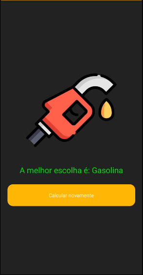

# ÁLCOOL & GASOLINA

Este foi o meu primeiro contato com o framework React Native. É um projeto bem simples, ele recebe duas entradas do usuário: o preço da gasolina e o preço do álcool (por litro), baseado nestes dados ele calcula qual é a melhor opção para comprar.

## 🚀 Sobre mim
Eu sou um desenvolvedor full-stack mobile. Trabalhei em dois projetos na empresa INVIA. Gosto de desafios, sou perspicaz e tenho força de vontade. 

## Screenshots

## Funcionalidades

- Recebe duas entradas do usuário;
- Calcula qual das opções é a melhor escolha.

## Autores

- [@MarcosFr98](https://github.com/Marcosfr98)

